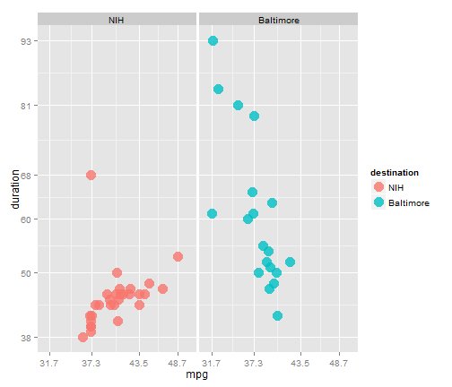

Commute:  Live in Baltimore, Work at the NIH
========================================================

Looks like my commute to the NIH is more consistent than the ride home to Baltimore, and more fuel efficient too.  On the x-axis, 1 is Monday and 5 is Friday.  On the y-axis, duration in minutes.

 

Another look at fuel efficiency:

 

Without facetting:

 

Stray Observations:
 
 _The Slow Burn_ was a success (8/20/2014)!  I kept it 55 MPH the whole way and broke the 45 MPG barrier with 48.7 MPG clocking in at 53 minutes (obviously took more time, but there might be wiggle room because there was a wreck late on 495).  Next goal is 50 MPG at under an hour.

_The Fast Burn_ was also a success (9/4/2014)!  I "kept with the flow of traffic" and broke the 40 minute duration barrier with 38.75 minutes registering a still respectable 37.1 MPG.  There is no new speed goal.

_The Triple Point_:  elusive, beautiful, mysterious:  39 minutes, 39 MPG, 39-ish miles.  

Check out the .Rmd file to see code on how to read spreadsheets from Google Drive into R!  Many thanks to [Andrie de Vries and David Smith.](http://blog.revolutionanalytics.com/2014/06/reading-data-from-the-new-version-of-google-spreadsheets.html
)
